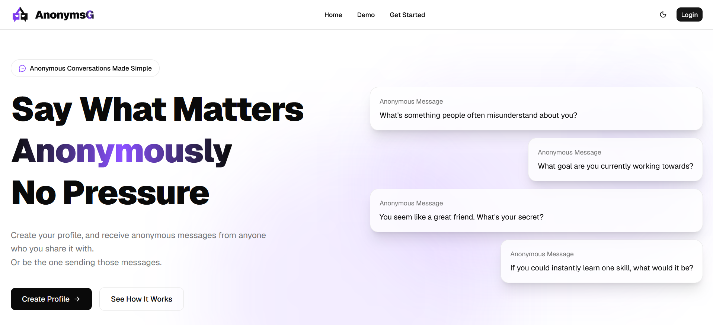
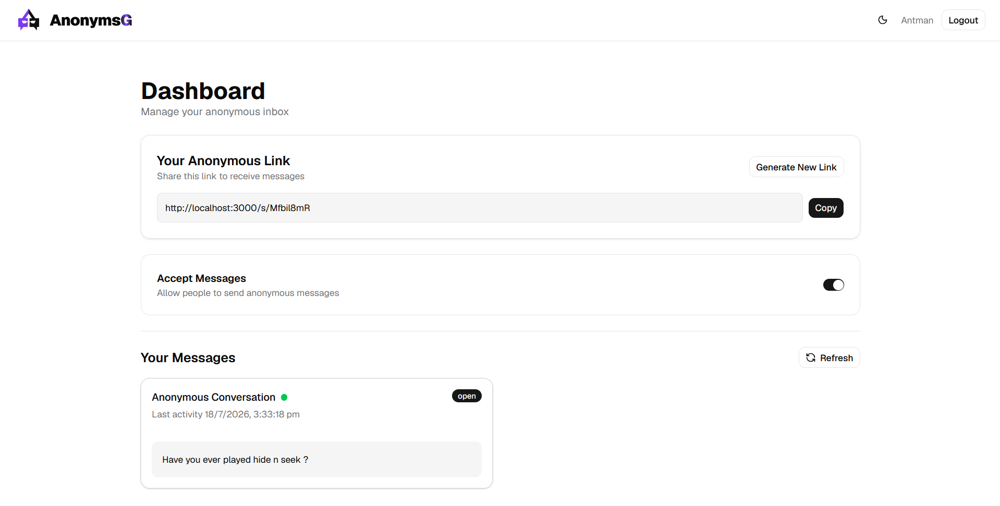
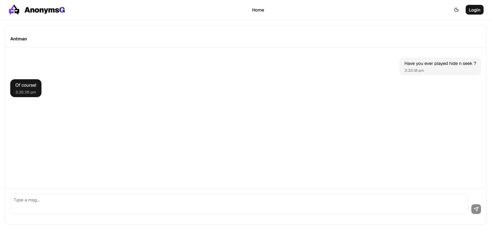

# AnonymsG

Anonymous messaging platform built with Next.js, TypeScript, MongoDB, and modern web technologies. It allows users to receive anonymous messages through shareable links. Users can manage conversations, reply anonymously, and continue discussions through private conversation threads.

## Preview

### Landing Page



### Dashboard



### Conversation Thread



Live Demo: [Deploy Link]

---

## Features

- Create a profile and receive anonymous messages from people after sharing a link
- Continue past conversations through private conversation links
- Reply to recieved messages through conversation threads
- Manage conversations (close, delete, and control message settings)
- Ability to toggle message acceptance status for receivers
- Send anonymous messages without making any accounts
- AI-assisted message suggestions to help senders start conversations

---

## Tech Stack

### Frontend

- Next.js
- TypeScript
- Tailwind CSS
- Shadcn
- React

### Backend

- Next.js API Routes
- MongoDB

### Authentication & Validation

- NextAuth.js
- Zod
- bcrypt

### Other Tools

- Vercel (Deployment)
- MailerSend (Email Verification)
- Google Gemini API (AI based suggestions)

---

# How It Works

1. User creates an account and verifies their identity.
2. Each user receives a unique shareable link.
3. Visitors send anonymous messages by visiting the shared link (no account).
4. Messages are stored and displayed in the user's dashboard.
5. Replies convert message interactions into private conversation threads.
6. Senders and receivers can continue conversations through conversation links.

---

# Architecture Overview

The application follows a full-stack Next.js architecture:

- Client components handle interactive UI and user interactions.
- Server-side routes manage authentication, messaging, and database operations.
- MongoDB stores users, conversations, and verification data.
- Authentication sessions protect user-specific resources.

---

# Database Design

## User

Stores:

- Authentication information
- User profile details
- Message receiving preferences

## Conversation

Stores:

- Sender and receiver relationship
- Conversation status (open|close)
- Message threads
- Activity timestamps

## VerificationToken

Stores:

- User information
- Email verification code
- Token expiry date

---

# Security & Design Decisions

- Passwords are securely hashed before storage.
- Protected routes use authentication-based access control.
- Input validation is handled using Zod schemas.
- Conversation access uses generated tokens instead of exposing sender identities.
- Sender metadata such as IP address or device information is never stored.

---

# Installation

Clone the repository:

```bash
git clone https://github.com/yuvraj-rag/AnonymsG.git
```

Install dependencies:

```bash
npm install
```

Run the development server:

```bash
npm run dev
```

Open browser and visit:

```text
[http://localhost:3000]
```

---

# Environment Variables

Create a `.env.local` file:

```env
DATABASE_URL=

NEXTAUTH_SECRET=

NEXTAUTH_URL=

EMAIL_API_KEY=
```

---

# Deployment

Deployed using:

- Vercel

Live URL:

[Deploy Link]

---

# Future Improvements

- Real-time messaging using Server Side Events (Currently polling based)
- Push notifications via Email
- Improved conversation UI and Images support
- Rate limiting